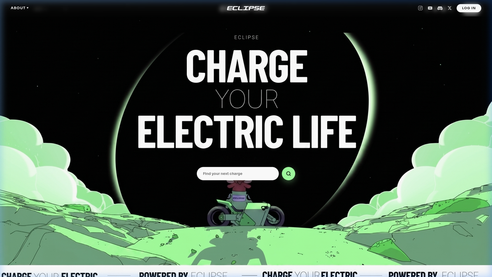
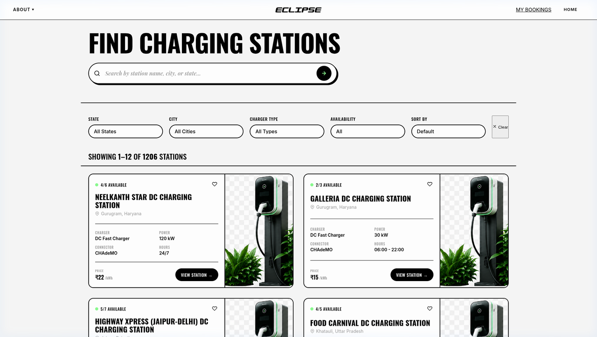
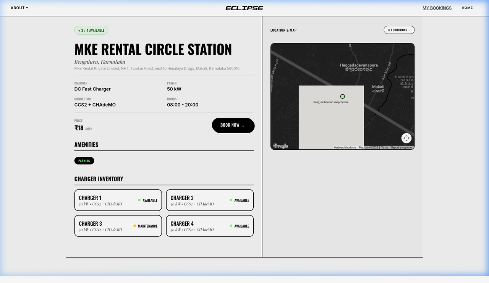
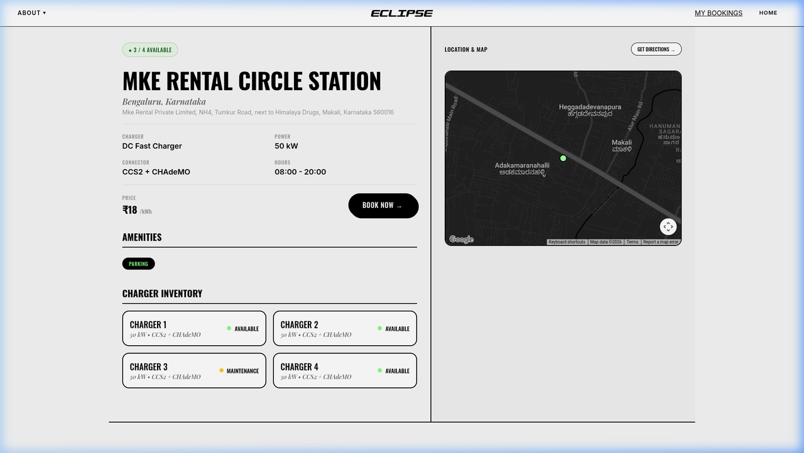
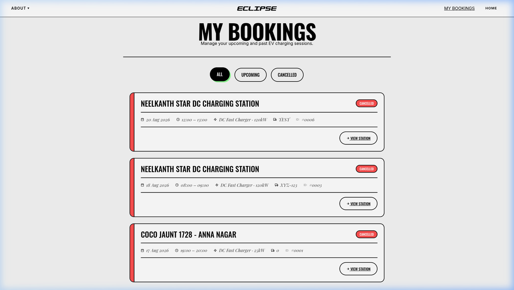

# Eclipse — EV Charging Platform

An EV Charging Platform and Station Finder built with Express.js, Vanilla CSS, and Google Maps API. The platform features station discovery, real-time availability tracking, custom interactive maps, and a slot booking flow powered by data sourced from Kaggle and Government of India EV Station Data (1,200+ charging stations).

---

## Page Overview and Screenshots

### 1. Landing Page (`index.html`)

Main entry point displaying platform statistics, network features, and quick search navigation.



### 2. Station Finder (`stations.html`)

Grid layout displaying station cards in a 2-column format on desktop. Features real-time state, city, charger type filtering, and price/power sorting.



### 3. Station Details (`station-details.html`)

Split-screen layout with 55% left panel for station metadata, specifications, amenities, and charger inventory, and 45% right panel for Google Maps integration.



### 4. Booking Flow (`booking.html`)

Step-by-step booking interface allowing date and time slot selection, vehicle details input, and real-time pricing calculation.



### 5. My Bookings Dashboard (`bookings.html`)

Dashboard displaying user reservation history with tabbed filters for All, Upcoming, and Completed bookings, along with cancellation options.



---

## Project Structure

```
Eclipse/
├── data/
│   ├── stations.json                # Normalized dataset from Kaggle & Govt of India
│   └── ev-charging-stations-india.csv
├── docs/
│   └── screenshots/                 # Application and architecture screenshots
├── scripts/
│   └── normalize-dataset.js         # Dataset preprocessor
├── server.js                        # Express.js REST API backend
├── index.html                       # Landing Page
├── stations.html                    # Station Finder page
├── stations.css                     # 2-column grid and station card styles
├── stations.js                      # Finder filtering & card rendering logic
├── station-details.html             # 55/45 split detail page
├── station-details.css              # Detail page grid & component styles
├── station-details.js              # Detail page API integration & Google Maps
├── booking.html                     # 3-step slot booking page
├── booking.css                      # Booking summary & checkout styling
├── booking.js                       # Slot selection & booking submission logic
├── bookings.html                    # User bookings dashboard
├── bookings.css                     # Bookings list & modal styling
├── bookings.js                      # Bookings CRUD & tab filter logic
├── style.css                        # Design system tokens & global utility CSS
├── package.json                     # Node.js dependencies
└── README.md                        # Project documentation
```

---

## REST API Endpoints

- `GET /api/stations` - Returns paginated list of stations with search and filter parameters.
- `GET /api/stations/:id` - Returns detailed station info, available chargers, and status.
- `GET /api/bookings` - Returns list of user bookings.
- `POST /api/bookings` - Submits a new slot reservation.
- `DELETE /api/bookings/:id` - Cancels an existing booking.

---

## Data Sources

The station database is compiled and normalized from:
- Kaggle Indian EV Charging Stations Dataset
- Government of India Public EV Station Data

---

## Architecture Diagram

The system architecture outlines the client layer, Express.js backend API, Kaggle and Government of India EV data sources, in-memory booking engine, and Google Maps integration.


